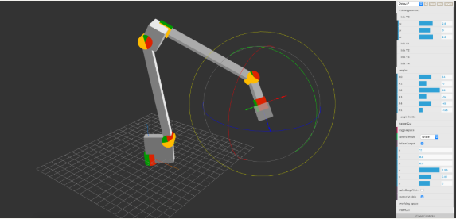
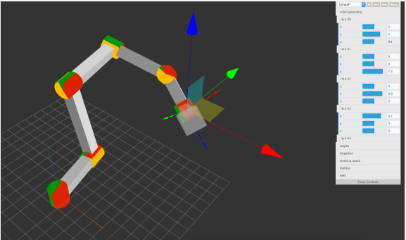
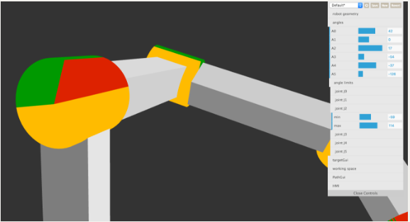
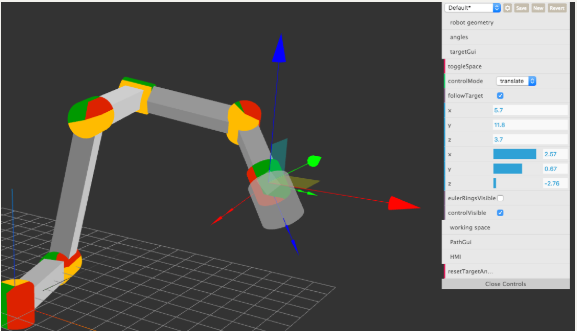
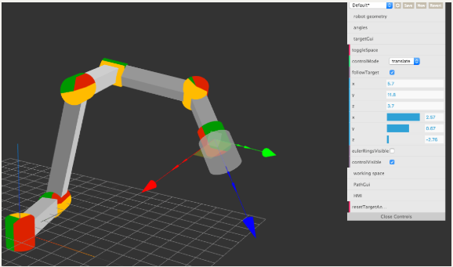
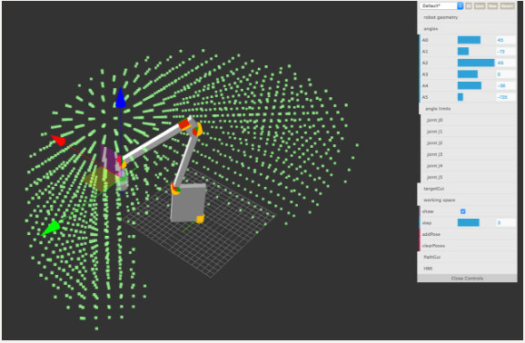
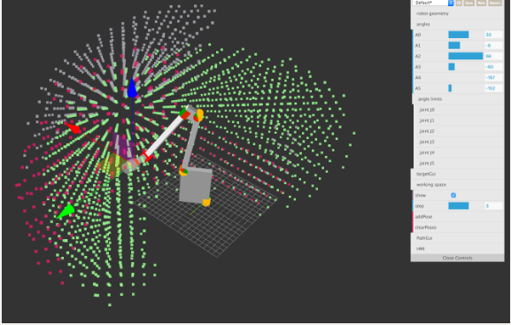

# robotArm_js_gui
这是一个基于 JavaScript 3D库three.js 的机器臂接口. 

# How To

Download or clone. Open `index.html` or [robot.glumb.de](http://robot.glumb.de). Enjoy 🤖😀 

You may need to use Chrome, since some ES6 features are not supported in other browsers yet.

# Geometry

Configure the robot geometry using the *geometry* tab.

# Angle limits

Angle limits are shown visualy. *red* negative, *green* positive

# Toggle Space

Switch between global and TCP aligned controls

# Working Space

Click add Pose to visualize the working area for the current TCP orientation. Add muliple poses to compare work area vs orientation.

